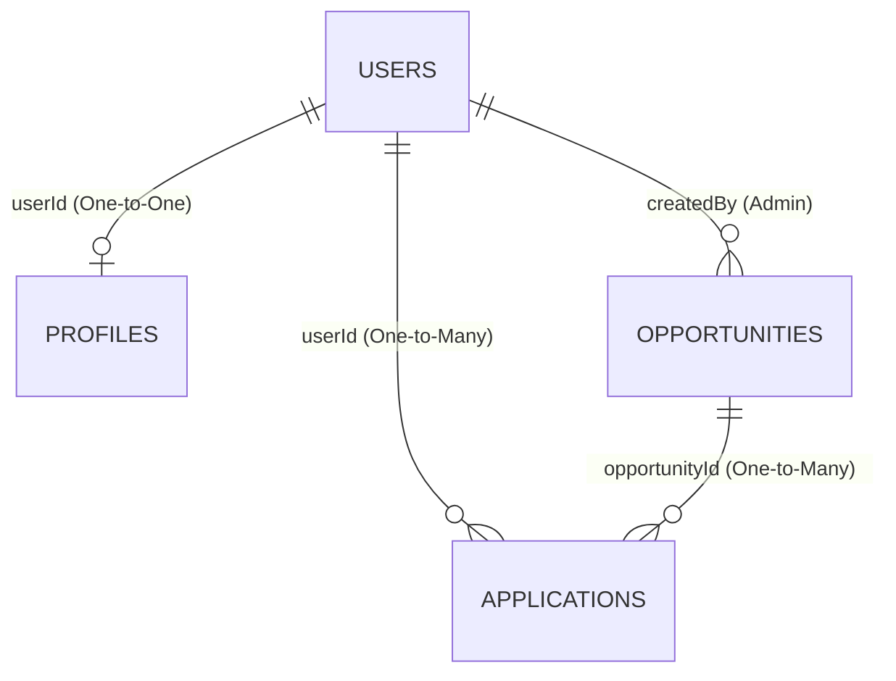

# Database Design Blueprint: AIESEC in Amaravati Opportunity Portal

This document defines the complete database architecture, Mongoose schemas, schema validations, relationship rules, performance indexing strategies, and raw JSON sample documents for the portal.

---

## 1. Relational Map (ERD)

The database utilizes a partially normalized MongoDB schema model. Student profile fields are decoupled from core login authentication accounts to support clean Role-Based Access Control (RBAC).



---

## 2. Collection Specifications

### 1. `users` Collection
Stores core authentication and identity keys.

#### Schema Details & Validations
| Field | Data Type | Validation Rules | Description |
| :--- | :--- | :--- | :--- |
| `_id` | `ObjectId` | Auto-generated by MongoDB | Primary Key |
| `name` | `String` | Required, trimmed, max length 50 | Full name of the user |
| `email` | `String` | Required, unique index, lowercase, validated email format regex | Login email credential |
| `password` | `String` | Required, minimum length 6, hashed via bcrypt, excluded (`select: false`) in standard queries | Cryptographic password hash |
| `role` | `String` | Required, enum: `['user', 'admin']`, default: `'user'` | Access control role |
| `createdAt` | `Date` | Auto-populated by Mongoose timestamps | Creation timestamp |
| `updatedAt` | `Date` | Auto-populated by Mongoose timestamps | Last update timestamp |

#### Indexes
* `unique_email`: Unique single-field index on `email: 1`

#### Mongoose Relationships
* Direct child reference: Linked dynamically to the `profiles` collection on `userId`.

#### Sample Document (JSON)
```json
{
  "_id": "603d2e1b9b1d8b2c4c8d1a11",
  "name": "Sai Kumar",
  "email": "saikumar.vitap@gmail.com",
  "password": "$2a$12$R9h/cIPz9qbC6c7H10A6eOu9hWz4.s9vJ7rO3J8M7Xw2G9fJ1c2a.",
  "role": "user",
  "createdAt": "2026-05-30T18:00:00.000Z",
  "updatedAt": "2026-05-30T18:00:00.000Z",
  "__v": 0
}
```

---

### 2. `profiles` Collection
Extended profile details specific to students (users).

#### Schema Details & Validations
| Field | Data Type | Validation Rules | Description |
| :--- | :--- | :--- | :--- |
| `_id` | `ObjectId` | Auto-generated by MongoDB | Primary Key |
| `userId` | `ObjectId` | Required, unique, references `users` collection | Foreign key pointing to core account |
| `phone` | `String` | Required, trimmed | Contact phone number |
| `university` | `String` | Required, enum validation (100km Amaravati radius plus Others) | Enrolled institution |
| `course` | `String` | Required, trimmed (e.g. B.Tech CSE, BBA) | Study major |
| `graduationYear`| `Number` | Required, minimum value 2000 | Planned graduation year |
| `linkedin` | `String` | Optional, regex format checking for valid LinkedIn link | LinkedIn profile link |
| `skills` | `[String]` | Array of strings, defaults to empty `[]` | Key skills list |
| `resumeUrl` | `String` | Optional, default empty, stores file pointer | Cloudinary PDF URL or local fallback path |
| `profileCompleted`| `Boolean` | Default `false` | Indicator if profile is 100% finished |

##### Allowed University Enum Values:
* `VIT AP`
* `SRM AP`
* `KL University`
* `Amrita Amaravati`
* `Acharya Nagarjuna University`
* `RVR & JC`
* `Vignan University`
* `VVIT`
* `Others`

#### Indexes
* `unique_profile_user`: Unique single-field index on `userId: 1`
* `demographic_university`: Single-field index on `university: 1`

#### Sample Document (JSON)
```json
{
  "_id": "603d2e2c9b1d8b2c4c8d1a12",
  "userId": "603d2e1b9b1d8b2c4c8d1a11",
  "phone": "+91 9876543210",
  "university": "VIT AP",
  "course": "B.Tech Computer Science",
  "graduationYear": 2027,
  "linkedin": "https://www.linkedin.com/in/saikumar-vitap",
  "skills": ["JavaScript", "React.js", "Node.js", "Python"],
  "resumeUrl": "https://res.cloudinary.com/aiesec-amaravati/image/upload/v1614532800/resumes/resume-603d2e1b9b1d8b2c4c8d1a11.pdf",
  "profileCompleted": true,
  "createdAt": "2026-05-30T18:05:00.000Z",
  "updatedAt": "2026-05-30T18:10:00.000Z",
  "__v": 0
}
```

---

### 3. `opportunities` Collection
Stores GV and GTa placement listings published by administrators.

#### Schema Details & Validations
| Field | Data Type | Validation Rules | Description |
| :--- | :--- | :--- | :--- |
| `_id` | `ObjectId` | Auto-generated by MongoDB | Primary Key |
| `title` | `String` | Required, trimmed, max length 100 | Job/Volunteer Title |
| `programType` | `String` | Required, enum: `['GTa', 'GV']` | Global Talent or Global Volunteer category |
| `country` | `String` | Required, trimmed | Location country |
| `city` | `String` | Required, trimmed | Location city |
| `description` | `String` | Required | Program details |
| `stipend` | `String` | Required, trimmed (e.g. "Unpaid", "$350 USD/month") | Stipend description |
| `duration` | `Number` | Required, minimum value 2 (weeks) | Duration in weeks |
| `skillsRequired`| `[String]` | Array of strings, defaults to empty `[]` | Preferred qualifications |
| `applicationDeadline`| `Date` | Required | Last date to apply |
| `status` | `String` | Required, enum: `['Open', 'Closed']`, default: `'Open'` | Recruiting status |
| `createdBy` | `ObjectId` | Required, references `users` collection | Foreign key pointing to Admin publisher |

#### Indexes
* `opportunistic_filter`: Compound index on `programType: 1` and `status: 1`
* `deadline_index`: Single-field index on `applicationDeadline: 1`

#### Sample Document (JSON)
```json
{
  "_id": "603d2e3d9b1d8b2c4c8d1a13",
  "title": "Global Marketing Analyst",
  "programType": "GTa",
  "country": "Germany",
  "city": "Munich",
  "description": "Join our team in Munich for a high-intensity marketing program analyzing product conversion pipelines.",
  "stipend": "€1,200 EUR/month",
  "duration": 24,
  "skillsRequired": ["Market Analysis", "SEO", "Google Analytics", "Communication"],
  "applicationDeadline": "2026-08-31T23:59:59.000Z",
  "status": "Open",
  "createdBy": "603d2e0a9b1d8b2c4c8d1a10",
  "createdAt": "2026-05-30T18:12:00.000Z",
  "updatedAt": "2026-05-30T18:12:00.000Z",
  "__v": 0
}
```

---

### 4. `applications` Collection
Stores student application submittals for specific exchange opportunities.

#### Schema Details & Validations
| Field | Data Type | Validation Rules | Description |
| :--- | :--- | :--- | :--- |
| `_id` | `ObjectId` | Auto-generated by MongoDB | Primary Key |
| `userId` | `ObjectId` | Required, references `users` | Foreign key pointing to applying Student |
| `opportunityId` | `ObjectId` | Required, references `opportunities` | Foreign key pointing to the target job/GV |
| `status` | `String` | Required, enum: `['Applied', 'Under Review', 'Accepted', 'Rejected']`, default: `'Applied'` | Workflow state |

#### Indexes
* `unique_user_opportunity`: **CRITICAL Compound Unique Index** on `{ userId: 1, opportunityId: 1 }` to prevent duplicate submissions.
* `status_tracking`: Single-field index on `status: 1`

#### Sample Document (JSON)
```json
{
  "_id": "603d2e4e9b1d8b2c4c8d1a14",
  "userId": "603d2e1b9b1d8b2c4c8d1a11",
  "opportunityId": "603d2e3d9b1d8b2c4c8d1a13",
  "status": "Applied",
  "createdAt": "2026-05-30T18:15:00.000Z",
  "updatedAt": "2026-05-30T18:15:00.000Z",
  "__v": 0
}
```
